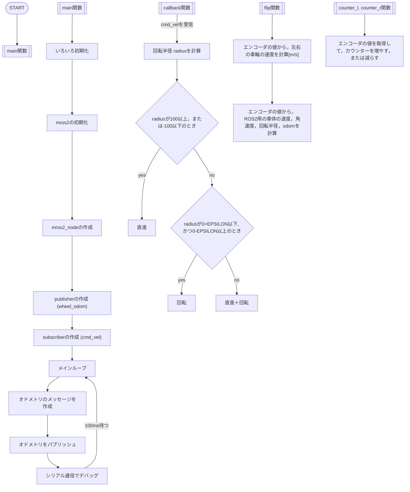

# sirius_driver
## About sirius_driver
sirius_driver is firmware for a robot, name sirius.<br>
sirius is Differential wheeled robot.<br>

## How to Build?
We developed using [mros2-mbed](https://github.com/mROS-base/mros2-mbed).<br>
If you want to build the program, please following a document written in mros2-mbed.<br>

## Building program in Our Environment
Use the bellow command.<br>
```./build.bash all NUCLEO_F767ZI sirius_driver```<br>

If you haven't setup environment
1. setup from [here](https://github.com/mROS-base/mros2-mbed).<br>
1. git clone this repository, under mros2-mbed/workspace.<br>
```mv sirius_driver mros2-mbed/workspace```<br>
1.add under code to mbed_app.json target_overrides '*' for print float.
```
{
    "target_overrides": {
        "*": {
            "target.printf_lib"        : "std",
            "platform.stdio-baud-rate" : 115200,
            "platform.stdio-convert-newlines"   : true,
            "platform.stdio-buffered-serial"    : true,
            "platform.stdio-flush-at-exit"      : true
        }
    }
}
```
1. Copy under code to mros2-mbed/CMakeLists.txt <br>
```
# Copyright (c) 2021 smorita_emb
# SPDX-License-Identifier: Apache-2.0

cmake_minimum_required(VERSION 3.19.0)

set(MBED_PATH
    ${CMAKE_CURRENT_SOURCE_DIR}/mbed-os
    CACHE INTERNAL "")
set(MBED_CONFIG_PATH
    ${CMAKE_CURRENT_BINARY_DIR}
    CACHE INTERNAL "")
set(APP_TARGET mros2-mbed)

include(${MBED_PATH}/tools/cmake/app.cmake)

project(${APP_TARGET})

add_subdirectory(${MBED_PATH})
set(INCLUDE_DIR workspace/${PROJECT_NAME}/include)

if(DEFINED ENV{APPNAME})
  set(APP_NAME $ENV{APPNAME})
else()
  set(APP_NAME "echoback_string")
endif()
message(STATUS "APP_NAME=${APP_NAME}")
add_executable(${APP_TARGET} workspace/${APP_NAME}/app.cpp)

target_link_libraries(${APP_TARGET} mbed-os mbed-lwipstack mros2)
target_include_directories(${APP_TARGET} PUBLIC ${INCLUDE_DIR})

execute_process(COMMAND git submodule update --init --recursive
                WORKING_DIRECTORY ${CMAKE_CURRENT_SOURCE_DIR}/mros2)
add_library(mros2 INTERFACE)
add_subdirectory(mros2)

set(RTPS_CONFIG_INCLUDE_DIR "${PROJECT_SOURCE_DIR}/include")

target_include_directories(
  mros2-mbed
  PRIVATE workspace/${APP_NAME}
  PRIVATE workspace/custom_msgs
  PRIVATE ${RTPS_CONFIG_INCLUDE_DIR}
)

mbed_set_post_build(${APP_TARGET})

option(VERBOSE_BUILD "Have a verbose build process")
if(VERBOSE_BUILD)
  set(CMAKE_VERBOSE_MAKEFILE ON)
endif()
```

## flowchart



